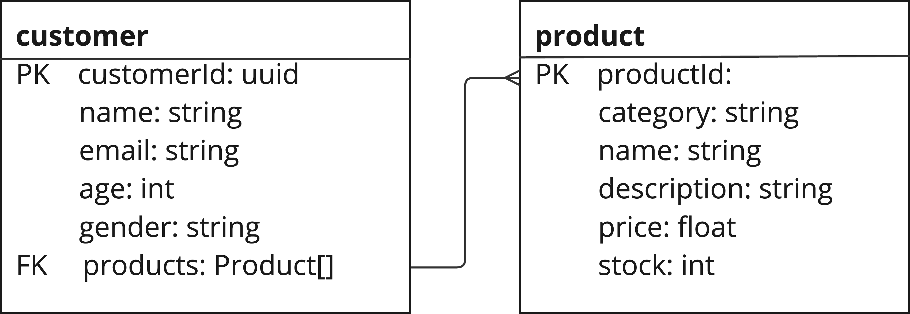

# Database

## Database structure

The database folder provides both a faked database stored in a JSON file (`db.json`), as well as the configuration for a local PostgreSQL database which can be setup easily using Docker, leaving you to decide which option would work best to simulate data for your team. The database contains tables representing two entities: product and customer. The UML diagram below represents the structure of and relationship between these entities.



## Setting up the local PostgreSQL database

### Prerequisites

In order to setup and use the local PostgreSQL database, the following technologies will be needed/are recommended:

- [Docker](https://www.docker.com/)
- [DBeaver](https://dbeaver.io/)

### Creating the database

If your team would prefer to use the local PostgreSQL database, you can do so by running the following commands from this folder (`database`):

```bash
docker volume create local_db
docker compose build
docker compose up
```

The last command here can be run using a `--detach` flag to run the database in the background. You can also reset the database by running the following commands (after which the above set of commands can be run again):

```bash
docker compose down
docker volume rm local_db
```

### Connecting to the database

We recommend using DBeaver to connect to the local PostgreSQL database. You can do so by following the steps below:

1. Open DBeaver
2. Click on the "+" icon in the left-hand sidebar
3. Select "Database" -> "PostgreSQL"
4. Enter the following details:
   - Host: `localhost`
   - Port: `5432`
   - Database: `postgres`
   - Username: `postgres`
   - Password: `password`
5. Click "Test Connection" to ensure that the connection is successful
6. Click "Finish" to save the connection

You should now have direct access to your database using DBeaver.

## How to use the database

The database can support all CRUD operations depending on your use case. If you wish to change the structure of the data or create new tables, you can do so.
